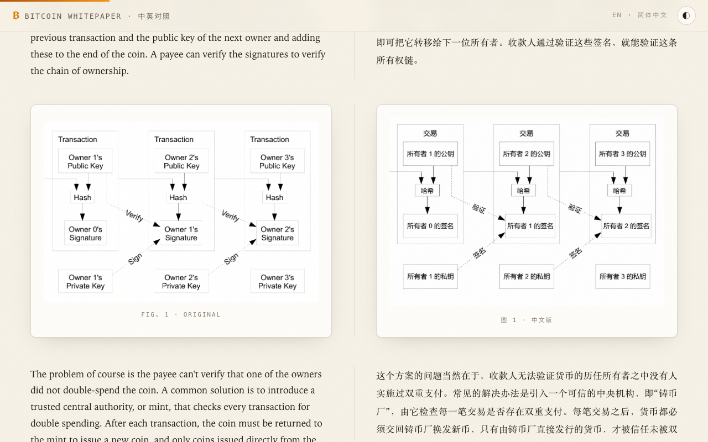
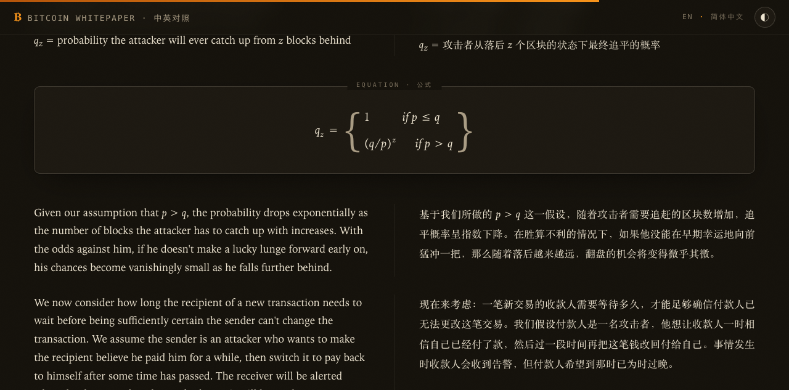

<div align="center">


# 比特币白皮书 · 中英对照

**Bitcoin: A Peer-to-Peer Electronic Cash System — 双语对照阅读网站**

[](https://btc.fate.red)
[](https://github.com/riba2534/bitcoin/actions)
[](LICENSE)
[](#技术实现)

<a href="https://btc.fate.red"><b>btc.fate.red</b></a> · 左栏英文原文 · 右栏简体中文 · 示意图全部汉化

</div>

---

2008 年 10 月 31 日，中本聪（Satoshi Nakamoto）在密码学邮件列表发表了九页论文
《Bitcoin: A Peer-to-Peer Electronic Cash System》，为其后的整个加密货币世界奠定了基石。

本项目把这份创世文献做成了一个**逐段中英对照**的阅读网站：页面从中缝一分为二，左侧是未作任何改动的英文原文，右侧是与之严格对齐的简体中文译文；原文中的 7 张示意图全部基于原图重绘为中文版，与英文原图并排呈现。你可以在一屏之内同时读到两种语言的同一段论述，随时互相印证。

## 预览

<div align="center">

**首页 —— 创世文献风格的编辑级排版**


**逐段对照 + 示意图汉化（左原图 · 右中文版）**



**暗色主题下的公式排版（纯 CSS 复刻）**



</div>

## 特性

- **逐段双语对照** — 摘要、正文 12 章、参考文献全文收录；每个英文段落与中文译文在同一行栅格中左右对齐，中缝分隔线悬停时高亮当前对照段落，逐段比对毫不费力
- **示意图全部汉化** — 交易链、时间戳服务器、工作量证明、Merkle 树、简化支付验证、交易输入输出、隐私模型共 7 张示意图，基于原始 PDF 提取的高清原图重绘为中文版，布局、线条、箭头与原图一一对应
- **公式与代码原样复刻** — 赌徒破产问题的分段函数、泊松分布求和式等 4 个公式用纯 CSS 排版（无 MathJax/KaTeX）；C 语言参考实现与攻击成功概率数据表横跨双栏居中展示
- **编辑级视觉设计** — 暖纸墨色调、中西文衬线字体搭配、比特币橙点缀；首页嵌有创世区块哈希，页脚藏着创世区块中的《泰晤士报》头条彩蛋
- **明暗双主题** — 默认跟随系统偏好，可一键切换并记忆选择
- **全端适配** — 桌面端左右分栏 + 超宽屏悬浮目录 + 阅读进度条；移动端自动上下堆叠，底部悬浮切换器支持「对照 / 仅英文 / 仅中文」三种阅读模式
- **零依赖、零构建** — 纯 HTML / CSS / 原生 JavaScript，不引用任何外部字体、CDN 或框架，克隆即可离线阅读

## 白皮书目录

| # | 原文 | 译文 |
|---|------|------|
| — | Abstract | 摘要 |
| 1 | Introduction | 引言 |
| 2 | Transactions | 交易 |
| 3 | Timestamp Server | 时间戳服务器 |
| 4 | Proof-of-Work | 工作量证明 |
| 5 | Network | 网络 |
| 6 | Incentive | 激励 |
| 7 | Reclaiming Disk Space | 回收磁盘空间 |
| 8 | Simplified Payment Verification | 简化支付验证 |
| 9 | Combining and Splitting Value | 价值的合并与分割 |
| 10 | Privacy | 隐私 |
| 11 | Calculations | 计算 |
| 12 | Conclusion | 结论 |
| — | References | 参考文献 |

## 本地运行

无需安装任何依赖：

```bash
git clone git@github.com:riba2534/bitcoin.git
cd bitcoin
python3 -m http.server 8000
# 浏览器打开 http://localhost:8000
```

或者直接双击 `index.html` 也能离线阅读。

## 目录结构

```
.
├── index.html                  # 单页全文（中英对照正文、公式、代码、数据表）
├── assets
│   ├── css/style.css           # 全部样式：明暗主题、双语栅格、公式排版、响应式
│   ├── js/main.js              # 主题切换 / 阅读进度 / 目录高亮 / 移动端语言切换
│   ├── logo.svg                # 项目 Logo
│   ├── screenshots/            # README 预览截图
│   └── figures
│       ├── en/                 # 7 张原版示意图（自原始 PDF 高清提取）
│       └── zh/                 # 7 张中文重绘版示意图
├── .github/workflows/deploy.yml  # 推送 main 即自动部署 Cloudflare Pages
└── LICENSE
```

## 自动部署

推送到 `main` 分支后，GitHub Actions 会自动将站点发布到 Cloudflare Pages：

```
git push → GitHub Actions → wrangler pages deploy → https://btc.fate.red
```

- 生产地址：[btc.fate.red](https://btc.fate.red)
- 备用地址：[bitcoin-whitepaper.pages.dev](https://bitcoin-whitepaper.pages.dev)

## 技术实现

- 双语对照采用 CSS Grid 双栏栅格：每个 `.pair` 是一行"英文格 + 中文格"，天然逐段对齐，无需 JavaScript 同步滚动
- 公式用 flexbox 组合分数线、求和号与放大花括号手工排版，效果与原论文一致且可随主题变色
- 中英文分别使用系统衬线字栈（Palatino/Georgia 与宋体系），不加载任何 Web 字体
- 图片带宽高占位避免布局位移；目录高亮基于 `IntersectionObserver`；主题偏好持久化于 `localStorage`

## 版权说明

- 白皮书英文原文由 Satoshi Nakamoto 发表于 [bitcoin.org](https://bitcoin.org/bitcoin.pdf)，基于 [MIT 许可证](https://bitcoin.org/en/posts/regarding-mit-public-license)公开发布
- 简体中文译文、中文版示意图与本站代码以 [MIT License](LICENSE) 开源，欢迎自由使用与转载

<div align="center">

*“The Times 03/Jan/2009 Chancellor on brink of second bailout for banks.”*

</div>
